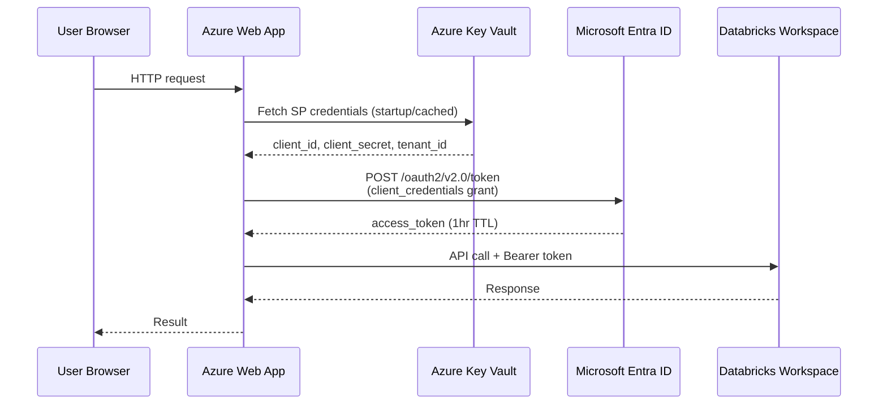
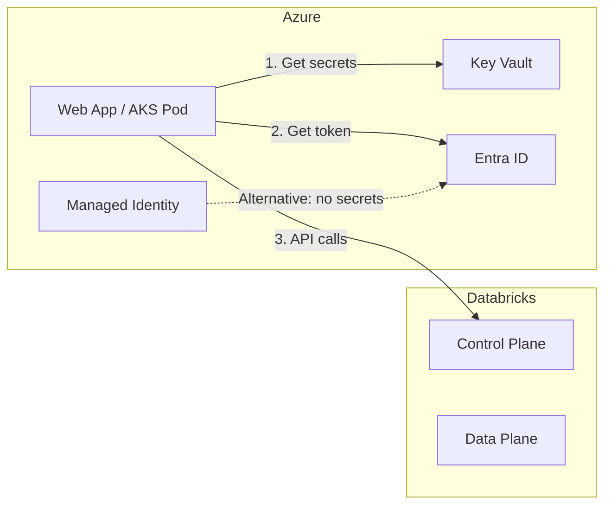
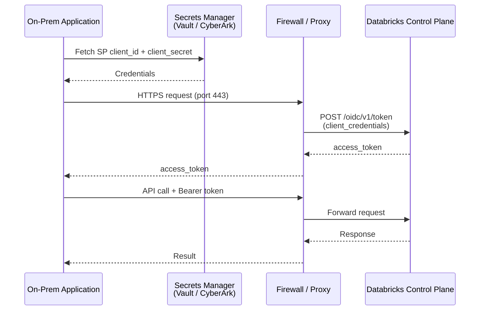
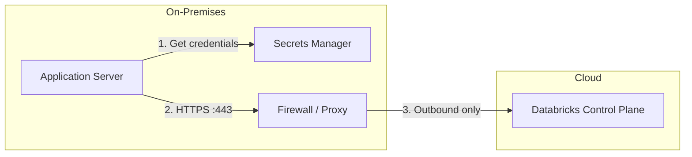
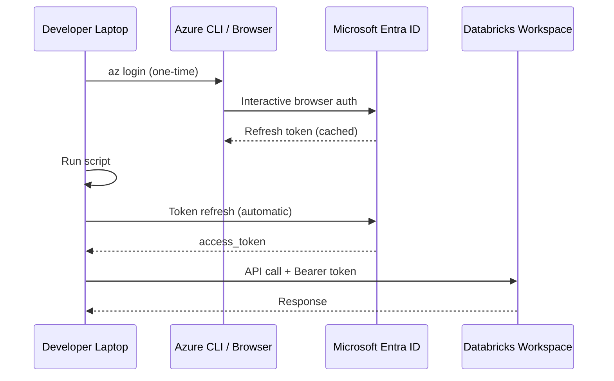
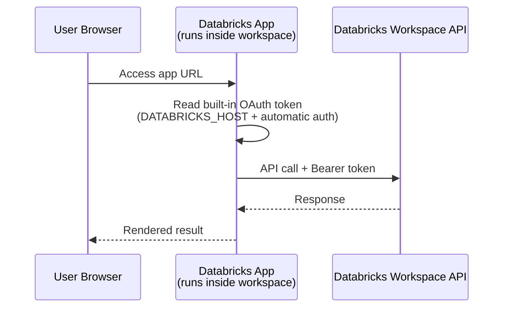
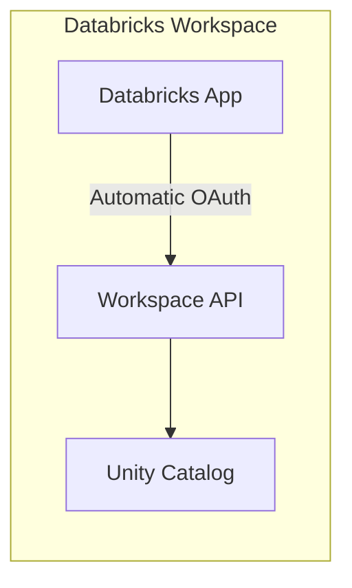
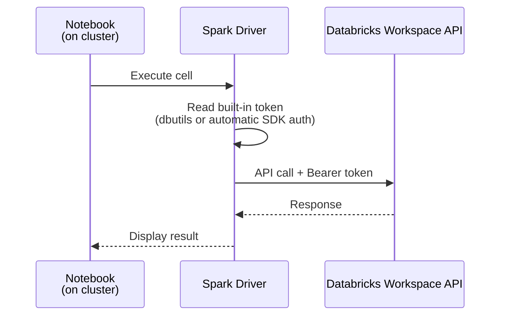
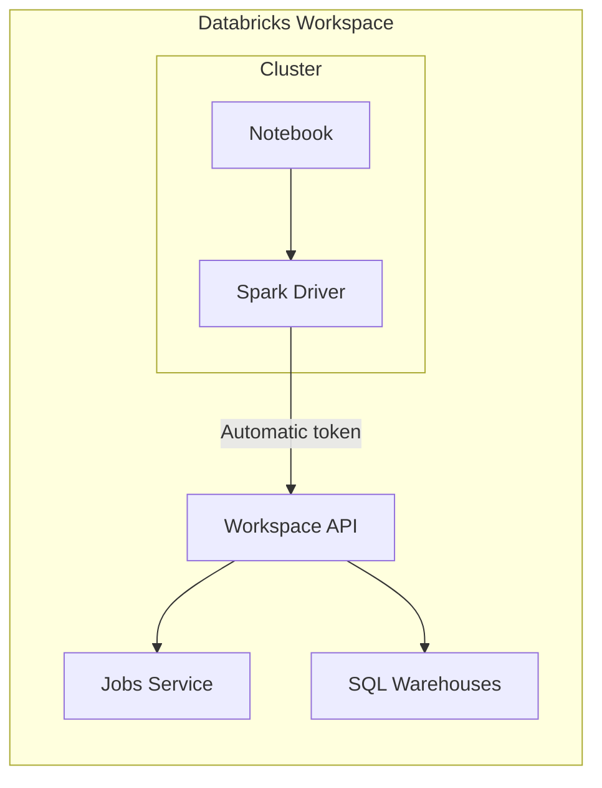
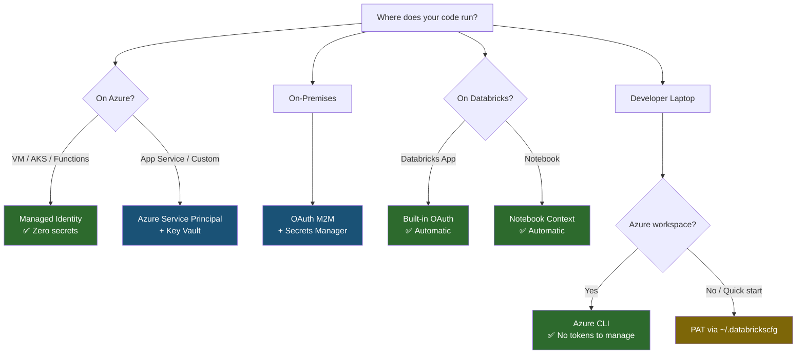

# Deployment Patterns & Authentication Best Practices

This guide covers recommended authentication patterns for common deployment scenarios when connecting to the Databricks Workspace API.

## Quick Reference

| Scenario | Recommended Auth | Secrets Storage | Section |
|----------|-----------------|----------------|---------|
| Azure Web App → Databricks | Azure Service Principal or Managed Identity | Azure Key Vault | [1](#1-azure-web-app--databricks) |
| On-prem App → Databricks | OAuth M2M (Service Principal) | HashiCorp Vault / on-prem secrets manager | [2](#2-on-prem-app--databricks) |
| Developer Laptop | Azure CLI or PAT | Local config (`~/.databrickscfg`) | [3](#3-developer-laptop) |
| Databricks App → Workspace API | Built-in OAuth (app identity) | Automatic (no secrets needed) | [4](#4-databricks-app--workspace-api) |
| Databricks Notebook → Workspace API | Built-in notebook context | Automatic (no secrets needed) | [5](#5-databricks-notebook--workspace-api) |

---

## 1. Azure Web App → Databricks

A web application hosted on Azure (App Service, AKS, Azure Functions, Container Apps) calling the Databricks Workspace API.

### Network Flow



### Architecture



### Recommended Auth: Azure Service Principal (preferred) or Managed Identity

**Option A — Service Principal with Key Vault:**

```typescript
// Node.js — credentials from environment (injected from Key Vault)
const client = new DatabricksWorkspaceClient({
  host: process.env.DATABRICKS_HOST,
  azureClientId: process.env.AZURE_CLIENT_ID,       // from Key Vault
  azureClientSecret: process.env.AZURE_CLIENT_SECRET, // from Key Vault
  azureTenantId: process.env.AZURE_TENANT_ID,
});
```

```python
# Python — same pattern
client = DatabricksWorkspaceClient(AuthConfig(
    host=os.environ["DATABRICKS_HOST"],
    azure_client_id=os.environ["AZURE_CLIENT_ID"],
    azure_client_secret=os.environ["AZURE_CLIENT_SECRET"],
    azure_tenant_id=os.environ["AZURE_TENANT_ID"],
))
```

**Option B — Managed Identity (zero secrets):**

```python
# Python — system-assigned managed identity
client = DatabricksWorkspaceClient(AuthConfig(
    host="https://adb-123456789.12.azuredatabricks.net",
    azure_use_msi=True,
))

# User-assigned managed identity
client = DatabricksWorkspaceClient(AuthConfig(
    host="https://adb-123456789.12.azuredatabricks.net",
    azure_use_msi=True,
    azure_client_id="<user-assigned-mi-client-id>",
))
```

### Best Practices

- **Prefer Managed Identity** over Service Principal when running on Azure — eliminates secret rotation entirely
- Store SP credentials in **Azure Key Vault**, injected as environment variables via App Service config or AKS secrets
- Use a dedicated **Service Principal per application** — don't share credentials across apps
- Grant **least-privilege workspace permissions** to the SP (e.g., CAN_MANAGE on specific jobs, not workspace admin)
- Token caching is handled automatically by this client (30s expiry buffer)
- Enable **Private Link** between your Azure VNet and Databricks for network-level isolation

---

## 2. On-Prem App → Databricks

An application hosted in a customer's on-premises data center or private cloud connecting to Databricks over the internet or a private connection.

### Network Flow



### Architecture



### Recommended Auth: OAuth M2M (Service Principal)

```typescript
// Node.js
const client = new DatabricksWorkspaceClient({
  host: "https://your-workspace.cloud.databricks.com",
  clientId: process.env.DATABRICKS_CLIENT_ID,       // from Vault
  clientSecret: process.env.DATABRICKS_CLIENT_SECRET, // from Vault
});
```

```python
# Python
client = DatabricksWorkspaceClient(AuthConfig(
    host="https://your-workspace.cloud.databricks.com",
    client_id=os.environ["DATABRICKS_CLIENT_ID"],
    client_secret=os.environ["DATABRICKS_CLIENT_SECRET"],
))
```

### Best Practices

- Use **OAuth M2M** (not PATs) — tokens are short-lived (1hr) and auto-refreshed by the client
- Never hardcode credentials — use an **enterprise secrets manager** (HashiCorp Vault, CyberArk, AWS Secrets Manager)
- Ensure the firewall allows **outbound HTTPS (443)** to:
  - `*.cloud.databricks.com` (AWS) or `*.azuredatabricks.net` (Azure)
  - `login.microsoftonline.com` (Azure SP token exchange)
- Consider **Azure Private Link** or **AWS PrivateLink** to avoid public internet traversal
- Use **IP access lists** on the Databricks workspace to restrict API access to your on-prem egress IPs
- Set `httpTimeoutSeconds` higher if crossing high-latency WAN links:
  ```typescript
  const client = new DatabricksWorkspaceClient({
    host: "...", clientId: "...", clientSecret: "...",
    httpTimeoutSeconds: 120,
  });
  ```

---

## 3. Developer Laptop

A developer running scripts, notebooks, or CLI tools from their local machine.

### Network Flow



### Recommended Auth: Azure CLI (Azure) or PAT (quick start)

**For Azure Databricks — use Azure CLI:**

```bash
# One-time login
az login
```

```typescript
// Node.js — no secrets needed, uses your az login session
const client = new DatabricksWorkspaceClient({
  host: "https://adb-123456789.12.azuredatabricks.net",
  authType: "azure-cli",
});
```

```python
# Python
client = DatabricksWorkspaceClient(AuthConfig(
    host="https://adb-123456789.12.azuredatabricks.net",
    auth_type="azure-cli",
))
```

**For quick prototyping — PAT via config profile:**

```ini
# ~/.databrickscfg
[DEFAULT]
host = https://your-workspace.cloud.databricks.com
token = dapi...
```

```python
# Python — picks up ~/.databrickscfg automatically
client = DatabricksWorkspaceClient()
```

```typescript
// Node.js — same
const client = new DatabricksWorkspaceClient();
```

### Best Practices

- **Azure CLI** is preferred over PATs for Azure workspaces — no tokens to copy/rotate, uses your corporate SSO
- If using PATs, store them in `~/.databrickscfg` (not in code or environment variables)
- Use **named profiles** for multiple workspaces:
  ```ini
  [DEV]
  host = https://dev-workspace.azuredatabricks.net
  token = dapi-dev-...

  [PROD]
  host = https://prod-workspace.azuredatabricks.net
  token = dapi-prod-...
  ```
  ```python
  client = DatabricksWorkspaceClient(AuthConfig(profile="DEV"))
  ```
- **Never commit** `~/.databrickscfg` or `.env` files to version control
- Set short PAT expiry (7-30 days) and rotate regularly

---

## 4. Databricks App → Workspace API

A Databricks App (web application deployed within the Databricks platform) calling the Workspace API.

### Network Flow



### Architecture



### Recommended Auth: Built-in OAuth (automatic)

Databricks Apps automatically receive authentication credentials via environment variables. No secrets management needed.

```python
# Python — inside a Databricks App, just use defaults
from databricks.sdk import WorkspaceClient
w = WorkspaceClient()  # Auth is automatic

# Or with this library:
client = DatabricksWorkspaceClient()  # Picks up automatic credentials
```

```typescript
// Node.js — DATABRICKS_HOST is set automatically in the app environment
const client = new DatabricksWorkspaceClient();
```

### Best Practices

- **Do not hardcode** any credentials in Databricks Apps — the platform provides them automatically
- The app runs with the **identity of the user** accessing it (or the app's service principal)
- Use **app resources** (configured in `app.yaml`) to declare which workspace resources the app needs
- For apps that need a fixed service principal identity, configure the SP in the app's resource declarations
- All traffic stays **within the Databricks control plane** — no external network hops

---

## 5. Databricks Notebook → Workspace API

A notebook running on a Databricks cluster calling the Workspace API to manage jobs, query metadata, or orchestrate workflows.

### Network Flow



### Architecture



### Recommended Auth: Built-in notebook context (automatic)

Inside a Databricks notebook, authentication is automatic — the SDK uses the notebook's execution context.

```python
# Python — in a Databricks notebook
from databricks.sdk import WorkspaceClient
w = WorkspaceClient()  # Automatic auth from notebook context

# Or with this library (if installed on the cluster):
# pip install databricks-workspace-client
client = DatabricksWorkspaceClient()

# List and trigger jobs
jobs = client.jobs.list_jobs(name="etl-daily")
result = client.jobs.find_and_trigger(job_name="etl-daily", wait=True)
```

```python
# Alternative: use dbutils for token if needed
token = dbutils.notebook.entry_point.getDbutils().notebook().getContext().apiToken().get()
host = spark.conf.get("spark.databricks.workspaceUrl")

client = DatabricksWorkspaceClient(AuthConfig(
    host=f"https://{host}",
    token=token,
))
```

### Best Practices

- **Use the default SDK auth** — don't extract tokens manually unless you have a specific reason
- The notebook runs with the **identity of the user** who triggered it (interactive) or the **job owner** (scheduled)
- For scheduled jobs that call the API, ensure the **job owner** has appropriate workspace permissions
- Install this library on the cluster via `%pip install` or cluster-scoped init scripts
- Be mindful of **API rate limits** when calling the workspace API in loops from notebooks

---

## Authentication Decision Tree



**Green** = zero secrets to manage. **Blue** = secrets required but short-lived (auto-refreshed). **Yellow** = manual token management.

---

## Security Best Practices Summary

| Practice | Why |
|----------|-----|
| **Prefer Managed Identity / built-in auth** | Eliminates secrets entirely |
| **Use OAuth M2M over PATs for services** | Tokens are short-lived (1hr), auto-refreshed, auditable |
| **Store secrets in a vault** (Key Vault, HashiCorp Vault) | Never in code, env files, or repos |
| **One service principal per application** | Blast radius isolation, independent rotation |
| **Least-privilege permissions** | Grant only what the SP needs (CAN_MANAGE on specific jobs, not admin) |
| **Enable IP access lists** | Restrict API access to known egress IPs |
| **Use Private Link** where possible | Network-level isolation, no public internet |
| **Rotate PATs on a schedule** | 7-30 day expiry for development tokens |
| **Audit API access** | Enable Databricks audit logging to track who called what |
| **Never commit credentials** | Add `.env`, `~/.databrickscfg` to `.gitignore` |
